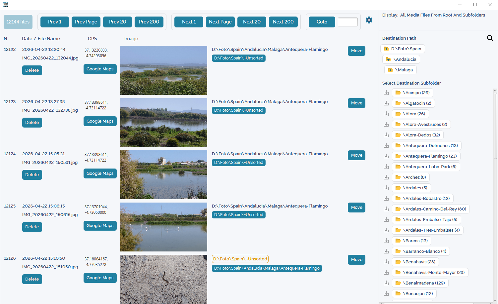
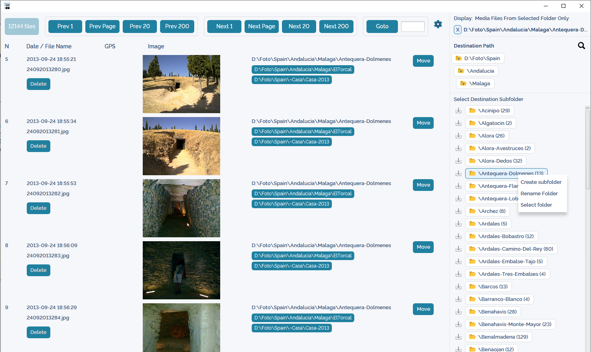
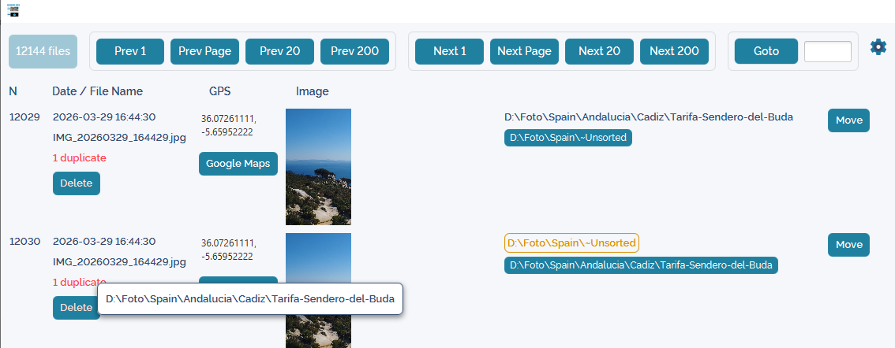
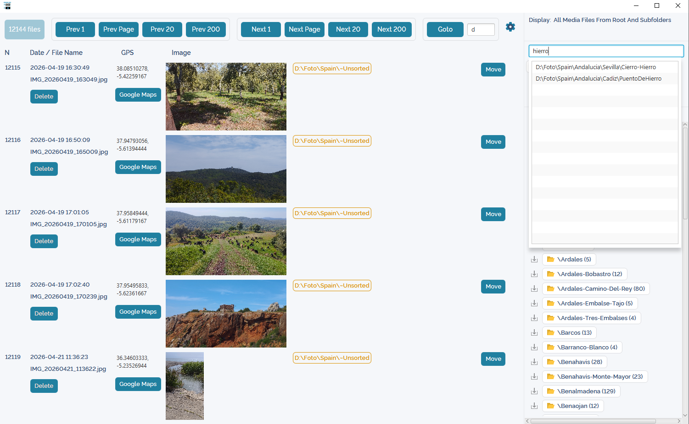
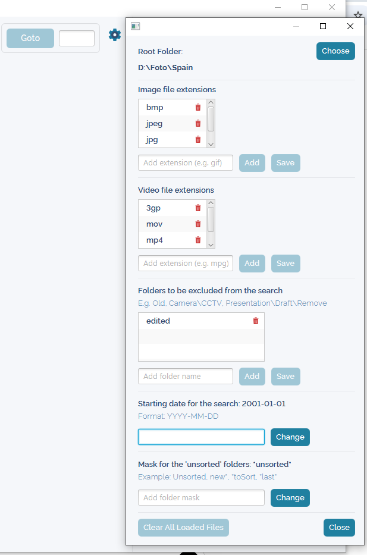

# PhotoOrganizer
A JavaFX desktop application to efficiently organize large collections of photos and videos into a structured folder system.

---

## Overview

I enjoy traveling and tend to accumulate a large number of photos and videos. To keep things organized, I store them locally using a folder structure like:

```bash
Spain → Community → Province → City → Place of Interest
```

Maintaining this manually can be tedious—especially after importing hundreds of new files.

**PhotoOrganizer** was created to simplify this process.

---

## Why this project exists

Organizing photos manually is repetitive, time-consuming, and easy to postpone. Existing tools often feel too heavy, too automatic, or not flexible enough for a custom folder structure.

This project focuses on a simple idea:
make manual sorting **fast, visual, and efficient**, while still keeping full control over where files go.

---

## Features

* 🗂️ **Chronological View**
  Browse all images and videos ordered by date.

* 📁 **Quick File Organization**
  * Move files into the appropriate folder with minimal effort.
  * Create new folders on the fly if needed.
  * Find the destination folder by name

* 🧠 **Smart Suggestions**
  See folders previously used for files taken on the same date—helpful for grouping related content.

* 🖼️ **Thumbnails & Preview**

    * Thumbnails for both images and videos
    * Large preview for images
    * External video player for videos

* 🗺️ **GPS Integration**
  If a photo contains GPS metadata, open its location directly in Google Maps.

* ✏️ **File & Folder Management**

    * Delete images and videos
    * Rename and create folders directly from the app

* 🔁 **Duplicate Detection**

    * Duplicates are clearly marked (e.g., *"1 duplicate"*)
    * Hover over the label to see where the duplicate file is located

* 📂 **Folder Filtering**

    * Option to display only the contents of a selected folder

* ⚙️ **Configurable Behavior**

    * Specify which file types should be loaded
    * Define folder names that should be skipped

* ⏩ **Fast Navigation**
  Move through your collection efficiently:

    * Next item
    * Skip 5, 20, or 200 items
    * Jump to any position
    * Jump by date (e.g., `2021-` or `2021-01`) to the first matching or next available item
* 🧾 **Logging**
  - Logs key user actions and errors
  - Log files are stored locally for troubleshooting
---

## Use Case

1. Copy photos and videos from your phone into an `Unsorted` folder.
2. Open PhotoOrganizer.
3. Review files in chronological order.
4. Move each item to its correct location in your folder structure.
5. Use suggestions, duplicate detection, and GPS data when needed.

---

## Tech Stack

* Java 17+ (or newer)
* JavaFX 21
* Maven

---

## Getting Started

### Requirements

* Java 17+
* JavaFX 21
* Maven

### Run the application

```bash
# Clone the repository
git clone https://github.com/spain-martian/PhotoOrganizer.git 

# Navigate to the project folder
cd PhotoOrganizer

# Run with Maven
mvn clean javafx:run
```

> Make sure JavaFX is properly configured in your environment if required.

---

## Configuration

The application includes a configuration file where you can:

* Define which file extensions should be processed (e.g., `.jpg`, `.png`, `.mp4`)
* Specify folder names that should be ignored during browsing
* Specify the folder name pattern for unsorted folders
* Load files starting from a specified date.

---

## Notes

* The app is designed for personal/local use with large photo collections.
* Folder structure is flexible—you are not forced into a strict hierarchy.

---

## Screenshots

### Main View


### Folder Selection


### Duplicate Detection


### Search Folder


### Settings


---


## Contributing

This is a personal project, but suggestions and improvements are welcome.

---

## 📄 License

MIT

---
